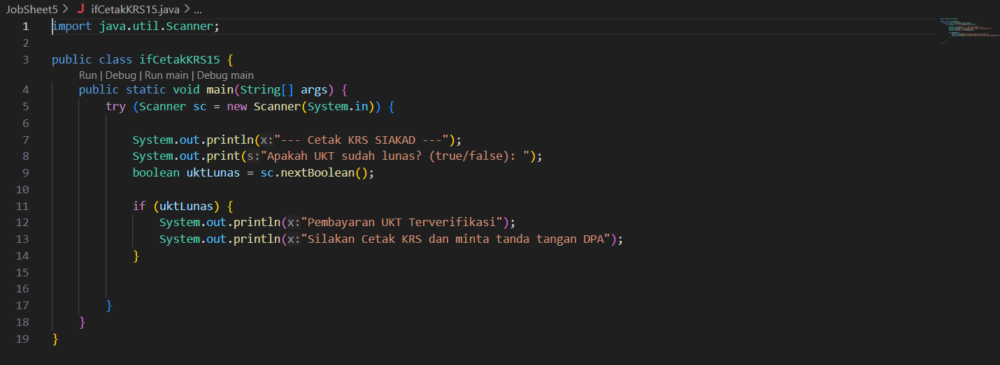
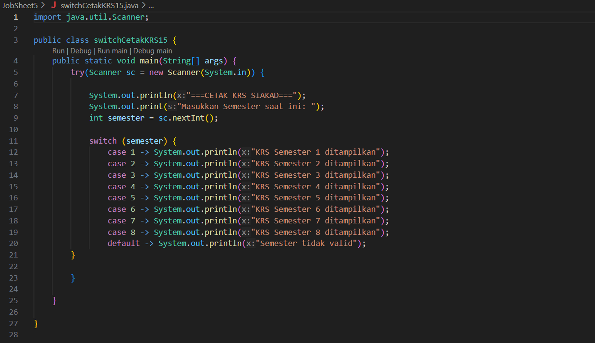
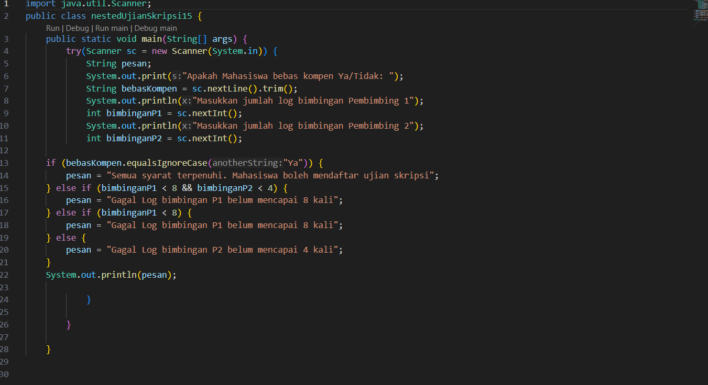
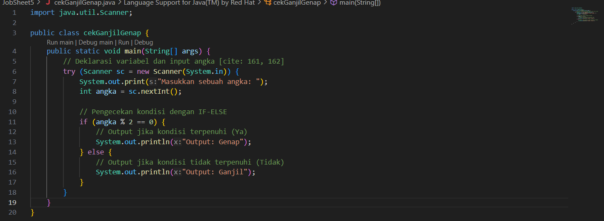
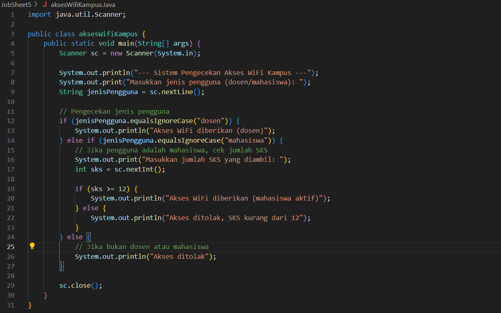

# Jawaban dan Laporan Praktikum Jobsheet 5 - Pemilihan #
## Repositori ini berisi jawaban dari pertanyaan dan implementasi kode program untuk Jobsheet 5: Pemilihan dalam mata kuliah Dasar Pemrograman. ##

**Percobaan 1: Penerapan IF dan IF-ELSE untuk Mencetak KRS**
__Jawaban Pertanyaan__

1. Mengapa pengecekan pada struktur IF tidak melibatkan operator relasional?
Jawaban: Karena variabel uktLunas sudah bertipe data boolean, yang nilainya hanya true atau false. Struktur if (uktLunas) secara langsung mengevaluasi nilai kebenaran dari variabel tersebut. Jika uktLunas bernilai true, kondisi dianggap terpenuhi. Penggunaan operator relasional seperti if (uktLunas == true) menjadi tidak perlu (redundan).

2. Hasil jika pengguna mengisikan nilai false?
Jawaban: Jika pengguna memasukkan nilai false, program tidak akan menampilkan output apapun dan akan langsung selesai. Hal ini terjadi karena kondisi if tidak terpenuhi, dan belum ada blok else yang menangani kondisi sebaliknya.

3. Modifikasi Program dengan struktur ELSE:
Program dimodifikasi dengan menambahkan blok else untuk memberikan pesan kepada pengguna jika UKT belum lunas.

**Percobaan 2: SWITCH-CASE untuk Mencetak KRS**
__Jawaban Pertanyaan__
1. Fungsi sintaks break:
Jawaban: Sintaks break berfungsi untuk menghentikan eksekusi kode di dalam blok switch-case secara paksa. Ketika sebuah case cocok dan dieksekusi, break akan mencegah program melanjutkan eksekusi ke case berikutnya ("fall-through").

2. Peran sintaks default:
Jawaban: Sintaks default berperan sebagai blok kode alternatif yang akan dieksekusi jika tidak ada satupun case yang nilainya cocok dengan variabel yang sedang diperiksa. Fungsinya mirip seperti blok else pada struktur if-else.

**Percobaan 3: Nested IF untuk Mengecek Syarat Ujian Skripsi**
__Jawaban Pertanyaan__
1. Apa yang terjadi jika mahasiswa menjawab "No" pada pertanyaan bebas kompen?
Jawaban: Jika mahasiswa menjawab "No", program akan langsung mengeksekusi blok else terluar dan menampilkan pesan: "Gagal! Mahasiswa masih memiliki tanggungan kompen". Ini terjadi karena kondisi pertama if (bebasKompen.equalsIgnoreCase("Ya")) bernilai false, sehingga seluruh blok pengecekan bimbingan akan dilewati.

2. Jelaskan maksud dari if (bimbinganP1 >= 8 && bimbinganP2 >= 4):
Jawaban: Potongan kode tersebut adalah sebuah kondisi yang menggunakan operator logika AND (&&). Kondisi ini akan bernilai true hanya jika kedua syarat terpenuhi secara bersamaan, yaitu: jumlah bimbingan dengan Pembimbing 1 minimal 8 kali (bimbinganP1 >= 8) DAN jumlah bimbingan dengan Pembimbing 2 minimal 4 kali (bimbinganP2 >= 4).

3. Alur pemeriksaan syarat mahasiswa:
Jawaban: Alur pemeriksaannya adalah sebagai berikut:

Level 1 (Pemeriksaan Kompen): Sistem pertama kali memeriksa apakah mahasiswa sudah bebas kompen. Jika tidak, proses berhenti dan menampilkan pesan kegagalan kompen.

Level 2 (Pemeriksaan Bimbingan): Jika bebas kompen, sistem melanjutkan pengecekan ke jumlah log bimbingan.

Jika bimbingan P1 (>=8) dan P2 (>=4) terpenuhi, mahasiswa dinyatakan boleh mendaftar.

Jika tidak, sistem akan memeriksa secara spesifik kekurangan bimbingan (apakah P1 saja, P2 saja, atau keduanya) dan memberikan pesan kegagalan yang sesuai.

Kode Program: nestedUjianSkripsiNoPresensi.java

**Implementasi Tugas Tambahan**
__Tugas 2: Implementasi Flowchart Ganjil-Genap__
Program ini dibuat berdasarkan flowchart yang diberikan untuk menentukan apakah sebuah bilangan yang diinput oleh pengguna termasuk bilangan ganjil atau genap.

Kode Program: CekGanjilGenap.java

__Tugas 3: Implementasi Flowchart Sistem Akses WIFI Kampus__
Program ini dibuat berdasarkan studi kasus tentang sistem pengecekan akses WiFi di kampus untuk dosen dan mahasiswa. Logika program menggunakan if-else if untuk membedakan jenis pengguna dan nested if untuk memeriksa syarat jumlah SKS bagi mahasiswa.

Kode Program: AksesWifiKampus.java

